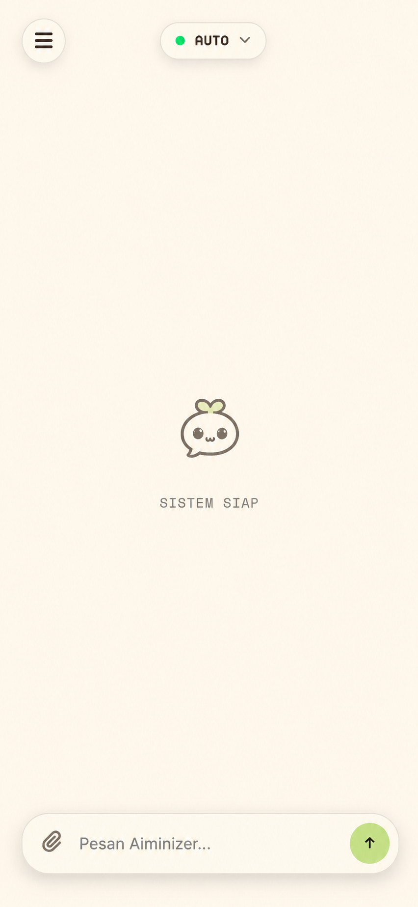

# 🚀 Aiminizer Pro
### *The Ultimate Organic-Logic Chat Interface*

[](https://opensource.org/licenses/MIT)
[](https://en.wikipedia.org/wiki/HTML5)
[](https://en.wikipedia.org/wiki/CSS)
[](https://developer.mozilla.org/en-US/docs/Web/JavaScript)
[](https://g4f.dev)

**Aiminizer Pro** adalah antarmuka chat AI yang menenangkan dengan estetika "Organic Refresh" yang fokus pada kejelasan dan kenyamanan mata. Dirancang untuk kecepatan, keamanan, dan pengalaman pengguna yang natural.

[Pelajari Fitur](#-fitur-unggulan) • [Cara Instalasi](#-memulai-pengembangan) • [Kontribusi](#-kontribusi)

---

## 📸 Preview



*Antarmuka chat AI yang responsif dengan desain organik yang bersih.*

---

## ✨ Fitur Unggulan

- 🤖 **Multi-Model Intelligence:** Akses instan ke berbagai model AI tercanggih.
- 🔄 **Smart Auto-Fallback:** Jangan biarkan chat terputus; sistem otomatis mencari model cadangan jika terjadi kegagalan.
- 🧠 **Thinking Visualization:** Lihat proses "berpikir" AI secara real-time dengan blok pemikiran transparan.
- ⌨️ **Smooth Typewriter:** Efek pengetikan yang mengalir mulus, seakan Anda berbicara dengan entitas hidup.
- 📂 **Context Aware:** Unggah berkas kode atau teks untuk memberikan konteks mendalam bagi AI.
- 🔒 **Privacy First:** Data Anda adalah milik Anda. Semua riwayat chat disimpan di memori lokal peramban Anda.
- 📐 **Math & Code Ready:** Dukungan penuh untuk LaTeX (matematika) dan penyorotan sintaks kode untuk developer.

---

## 🛠️ Tech Stack

| Komponen | Teknologi |
| :--- | :--- |
| **Logic** | Vanilla JavaScript (ES6+) |
| **Styling** | Modern CSS3 (Organic Design) |
| **Markdown** | [marked.js](https://marked.js.org/) |
| **Syntax** | [highlight.js](https://highlightjs.org/) |
| **Math** | [KaTeX](https://katex.org/) |
| **Animation** | [Anime.js](https://animejs.com/) |
| **Backend** | [g4f.dev](https://g4f.dev/) (Edge AI Providers) |

---

## 🚀 Memulai Pengembangan

### Persyaratan
- Peramban web modern (Chrome, Safari, Firefox).
- Koneksi internet (untuk memuat library via CDN).

### Langkah-langkah
1. **Klon Repositori**
   ```bash
   git clone https://github.com/user/aiminizer-mobile.git
   cd aiminizer-mobile
   ```
2. **Jalankan Lokal**
   Gunakan server statis favorit Anda untuk pengalaman terbaik:
   ```bash
   # Python 3
   python3 -m http.server 8000
   
   # Node.js
   npx serve .
   ```
3. **Buka di Browser**
   Akses `http://localhost:8000` dan mulai berinteraksi dengan AI!

---

## 🏗️ Arsitektur Proyek

Struktur berkas yang bersih dan modular untuk memudahkan kustomisasi:

```text
📦 Aiminizer_mobile
 ┣ 📂 css
 ┃ ┗ 📜 styles.css    # Master stylesheet (Organic Theme)
 ┣ 📂 js
 ┃ ┗ 📜 app.js        # Core logic & AI integration
 ┣ 📂 asset
 ┃ ┣ 📜 logo.png      # Brand assets
 ┃ ┗ 📜 manifest.json # PWA configuration
 ┣ 📜 index.html      # Main app entry point
 ┗ 📜 README.md       # Ultimate documentation
```

---

## 💾 Penyimpanan Data

Aplikasi ini menggunakan **LocalStorage** peramban untuk menjaga privasi tetap di tangan pengguna:

- `aiminizer_history`: Menyimpan struktur percakapan.
- `aiminizer_theme`: Menyimpan preferensi visual (Default: Organic).
- `aiminizer_cookies_accepted`: Status izin privasi.

---

## 🤝 Kontribusi

Kami menyukai kolaborasi! Jika Anda memiliki ide cemerlang:
1. Fork proyek ini.
2. Buat cabang fitur baru (`git checkout -b fitur/Keren`).
3. Komit perubahan Anda (`git commit -m 'Menambah sesuatu yang keren'`).
4. Push ke cabang tersebut (`git push origin fitur/Keren`).
5. Buka Pull Request.

---

Made with ⚡ by **Ziyad Studio**

[](https://github.com/ziyad-studio)
